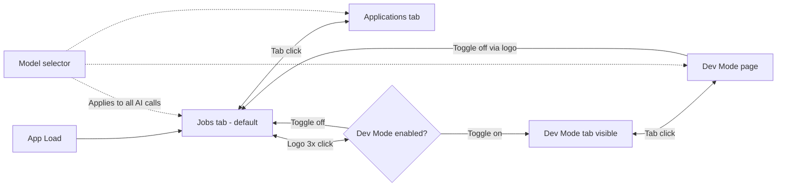
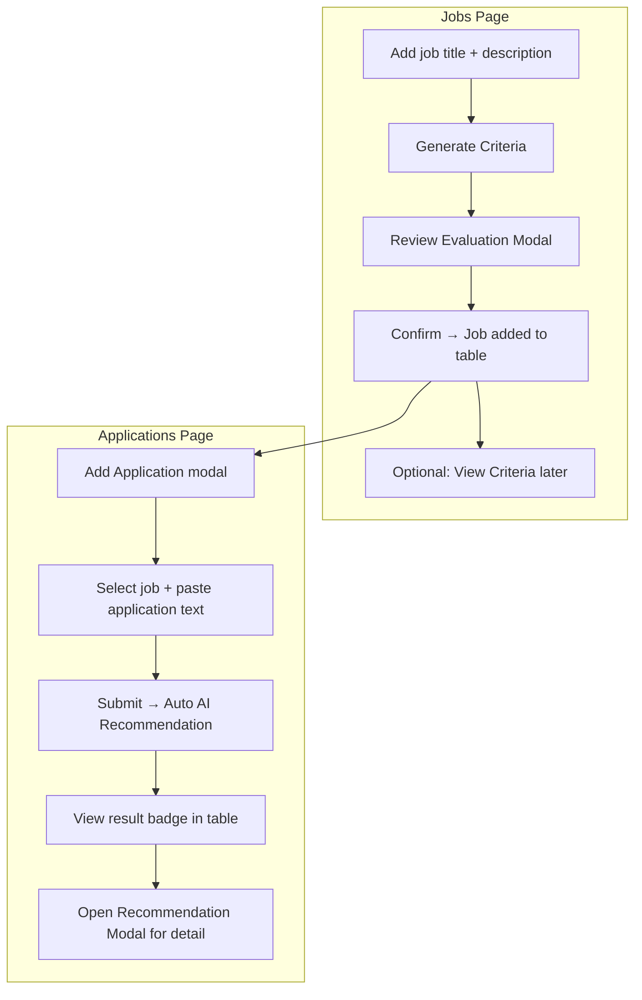
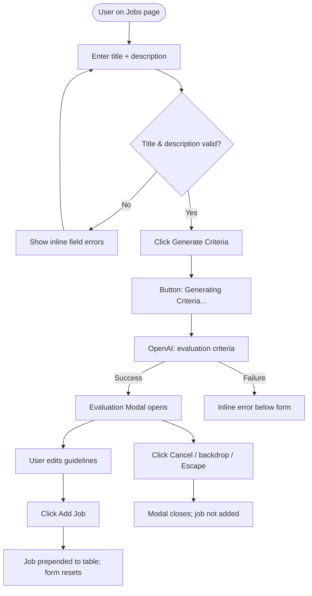
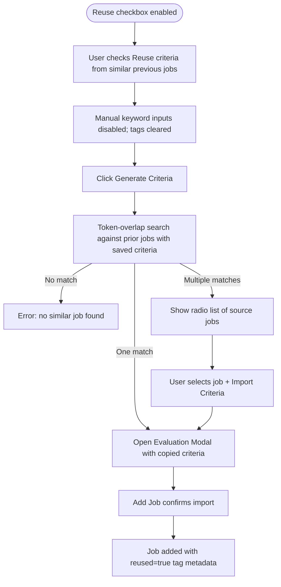
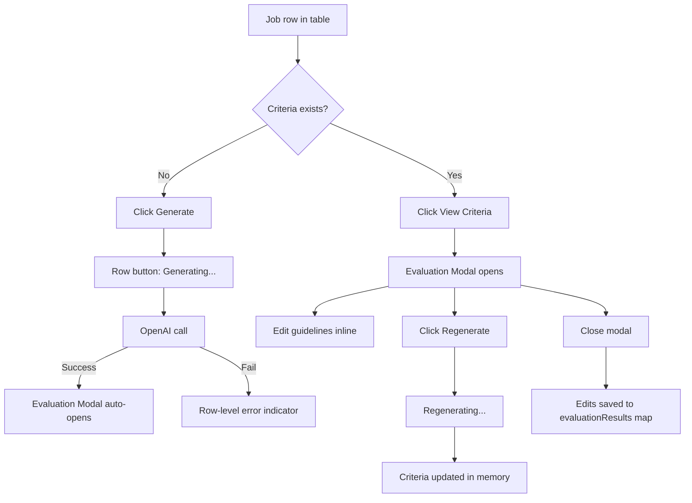
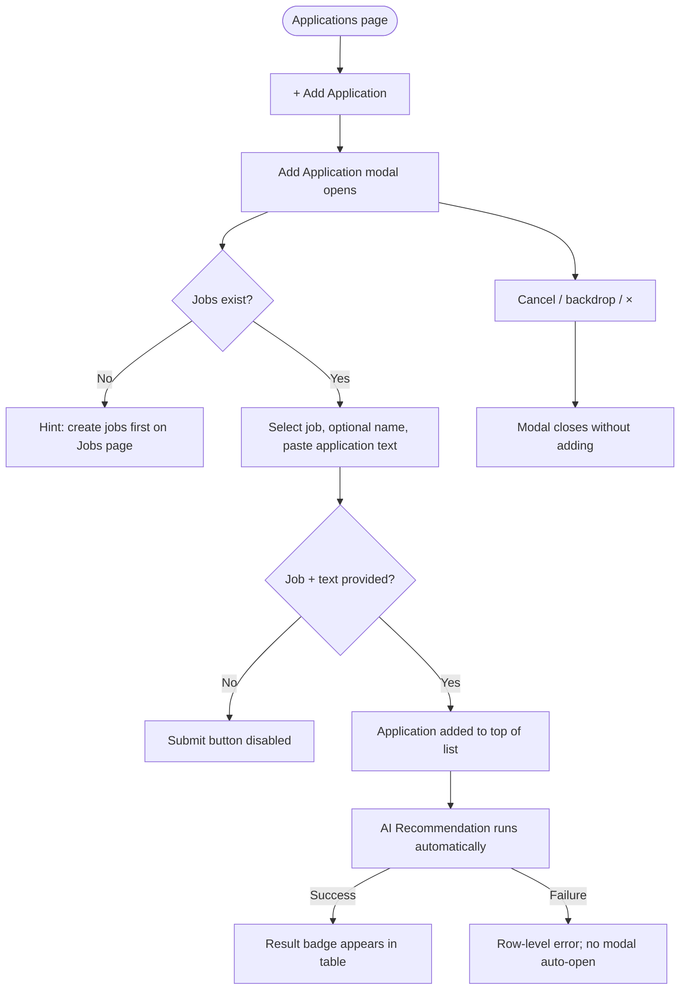
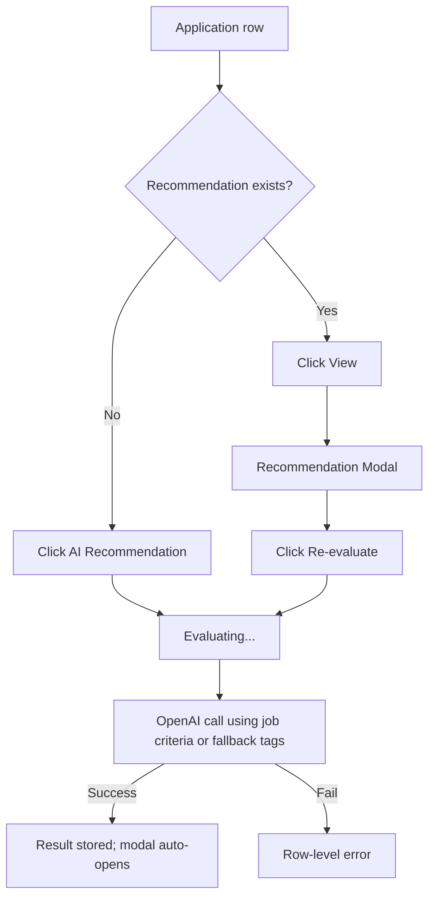
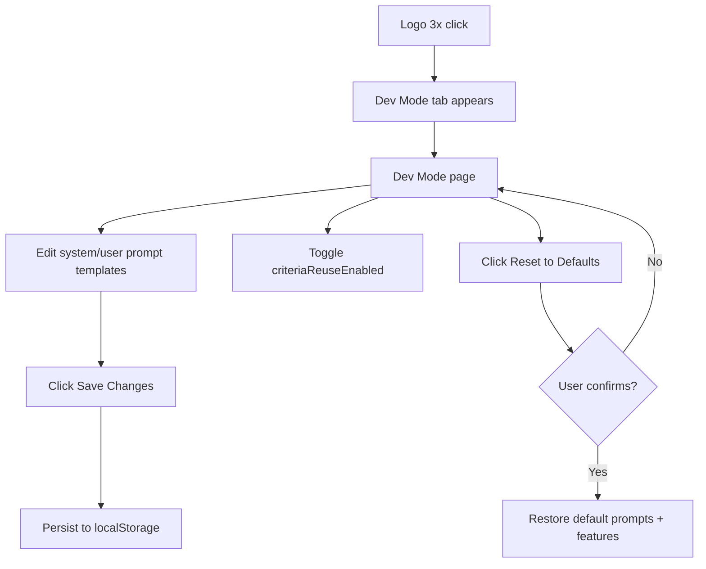
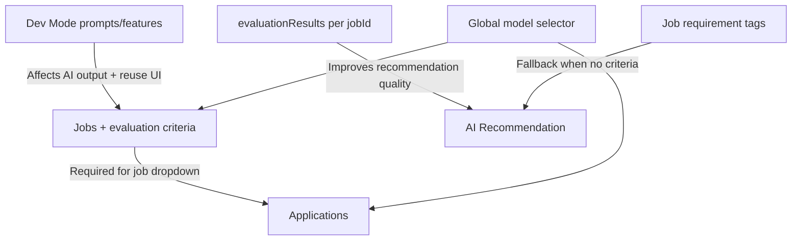

# JobBoard UX Flow Document

## 1. Document Purpose

This document describes the end-to-end user experience flows for **JobBoard** (prototype name: *AI Screening*), an AI-assisted candidate screening web app. It maps how recruiters and developers move through the product, what they see at each step, and where decisions, modals, and AI calls occur.

**Related documents**
- `REQUIREMENTS.md` — functional and acceptance criteria
- `UX_RESEARCH_PLAN.md` — moderated demo research plan for evaluation and scoring trust

---

## 2. Product Overview

JobBoard helps recruiters:

1. Capture job postings and define screening criteria (manually, via AI, or by reusing prior jobs).
2. Review and edit AI-generated evaluation guidelines.
3. Submit candidate applications and receive structured AI recommendations.
4. Tune prompts and experimental features in a hidden Dev Mode.

**Platform:** Single-page React app with tab-based navigation (no authentication, no backend persistence for business data).

---

## 3. User Personas

| Persona | Goal | Primary flows |
|---------|------|---------------|
| **Recruiter / Hiring Coordinator** | Screen applicants quickly against role criteria | Jobs → Applications |
| **Developer / QA** | Tune LLM prompts and enable experimental features | Dev Mode |

---

## 4. Information Architecture

```
JobBoard (header)
├── Logo (hidden Dev Mode toggle)
├── Navigation tabs
│   ├── Jobs (default)
│   ├── Applications
│   └── Dev Mode (visible only when enabled)
└── Model selector (global: gpt-4o | gpt-5.4 | gpt-5.5)

Jobs page
├── Add Job form
└── Jobs table

Applications page
├── Add Application modal
└── Applications table

Dev Mode page
├── Feature toggles
└── Prompt editors
```

---

## 5. Global Navigation Flow



### 5.1 Hidden Dev Mode Entry

| Step | User action | System response |
|------|-------------|-----------------|
| 1 | Click logo 3 times within 800 ms | Dev Mode toggles on/off |
| 2 | Dev Mode turns on | Dev Mode tab appears; user lands on Dev Mode page |
| 3 | Dev Mode turns off | Dev Mode tab hides; user returns to Jobs page |

### 5.2 Global Model Selection

- Model selector lives in the header on every page.
- Selected model applies to all AI features: evaluation criteria, skill suggestions, application recommendations.
- Default: `VITE_OPENAI_MODEL` env var, or `gpt-4o`.

---

## 6. Primary User Journey (Happy Path)

The core recruiter workflow spans two tabs:



---

## 7. Jobs Page Flows

### 7.1 Add Job — Standard (AI Generation)



**Entry point:** Add Job form at top of Jobs page.

**Required fields:** Job Title, Job Description.

**Success outcome:** New job appears at top of Jobs table with eligibility and additional requirement tags derived from generated criteria.

### 7.2 Add Job — Criteria Reuse (Experimental)

Available only when `criteriaReuseEnabled` is toggled on in Dev Mode.



**Decision point:** When multiple similar jobs exist, user must explicitly choose the source job before criteria import proceeds.

### 7.3 Generate / View Criteria (Existing Job)

For jobs already in the table:



**Concurrency rule:** Only one generate/regenerate request active across the Jobs table at a time. Other Generate buttons are disabled while a request runs.

### 7.4 Evaluation Modal — Interaction Model

| Section | Content | User can |
|---------|---------|----------|
| Eligibility Requirements | Requirement name, In JD / Not in JD badge, evaluation guideline textarea | Edit guideline; move item to Additional |
| Additional Requirements | Requirement name, badge, strong-fit and partial-fit guideline textareas | Edit both guidelines; move item to Eligibility |

**Close behavior**
- **From Job List:** Closing saves edits to in-memory `evaluationResults`.
- **From Add Job form:** Cancel discards draft; Add Job commits job + criteria.

**Dismiss methods:** Close button (×), backdrop click, Escape key.

### 7.5 Jobs Page Empty State

When no jobs exist, the table area shows:

> No jobs added yet. Fill in the form above to get started.

---

## 8. Applications Page Flows

### 8.1 Add Application



**Default applicant name:** `Unnamed Applicant` when name field is left empty.

**Note:** On submit, recommendation runs with `openModalOnComplete: false` — user sees the result in the table, not an auto-opened modal.

### 8.2 AI Recommendation (Manual)

For applications without a result, or to re-run:



**Criteria fallback:** Uses saved evaluation criteria for the linked job when available; otherwise falls back to raw job requirement tags.

**Concurrency rule:** Only one recommendation request active across the Applications table at a time.

### 8.3 Recommendation Result Semantics

| AI output (`overallRecommendation`) | UI label | Badge style |
|-------------------------------------|----------|-------------|
| `strong_fit` | FastTrack | Strong (green) |
| `partial_fit` | Eligible | Partial (amber) |
| `no_fit` | Needs Review | None (red/neutral) |

**Table Result column:** Shows overall badge only (summary and per-requirement breakdown live in the modal).

**Modal detail sections**

| Section | Per-item fit values | Display labels |
|---------|---------------------|----------------|
| Eligibility (`criticalFit`) | `met`, `not_met` | Met, Not Met |
| Additional (`additionalFit`) | `strong`, `partial`, `none` | Strong Fit, Partial Fit, No Fit |

Each item includes AI reasoning text below the requirement header.

### 8.4 Applications Page Empty State

When no applications exist:

> No applications yet. Click "+ Add Application" to get started.

---

## 9. Dev Mode Flow



### 9.1 Editable Prompt Templates

| Template | Used by |
|----------|---------|
| Evaluation Criteria | Job criteria generation |
| Evaluation Guideline (Assist) | Per-item eligibility assist (when enabled) |
| Additional Requirement Guideline (Assist) | Per-item additional assist (when enabled) |
| Skill Suggestions | Skills chip spark action in TagInput |
| Application Recommendation | Application scoring |

### 9.2 Feature Toggle Impact

| Toggle | When on | User-visible effect |
|--------|---------|---------------------|
| `criteriaReuseEnabled` | Add Job form | Shows reuse checkbox; disables manual tag entry when checked |

Dev Mode settings persist across page reload. All other data (jobs, applications, criteria, recommendations) does not.

---

## 10. Cross-Page Dependencies



| Prerequisite | Dependent flow | Behavior when missing |
|--------------|----------------|----------------------|
| At least one job | Add Application | Job dropdown unavailable; hint shown |
| Evaluation criteria | AI Recommendation | Falls back to raw job tags |
| `VITE_OPENAI_API_KEY` | Any AI action | Actionable error message; no silent failure |

---

## 11. UI States Reference

### 11.1 Loading States

| Location | Trigger | UI feedback |
|----------|---------|-------------|
| Add Job form | Generate Criteria | Button disabled; label "Generating Criteria..." |
| Add Job form | Criteria reuse matching | Button disabled; label "Matching previous job..." |
| Job List row | Generate / Regenerate | Spinner + "Generating…" / "Regenerating…" |
| Applications row | AI Recommendation | Spinner + "Evaluating…" |
| Recommendation Modal | Re-evaluate | Spinner + "Re-evaluating…" |
| TagInput (Skills) | Spark action | Loading state on skill suggestions |

### 11.2 Error States

| Location | Trigger | UI feedback |
|----------|---------|-------------|
| Form fields | Validation failure | Inline error below field |
| Add Job form | AI / reuse failure | Error message below form footer |
| Table row | AI failure | ⚠ Error indicator with tooltip |
| Modal header | Regenerate / re-evaluate failure | Error text in modal header |

**Error principle:** Failed operations do not clear previously saved data.

### 11.3 Empty States

| Page | Condition | Message |
|------|-----------|---------|
| Jobs | No jobs in list | Empty state with clipboard icon |
| Applications | No applications | Empty state with document icon |
| Evaluation Modal | No requirements in result | "No requirements were found to evaluate." |

---

## 12. Modal Inventory

| Modal | Trigger | Primary actions | Dismiss |
|-------|---------|-----------------|---------|
| Evaluation Criteria | Generate criteria (add or list) | Edit guidelines, Regenerate (list only), Add Job / close | ×, backdrop, Escape |
| Add Application | + Add Application button | Submit, Cancel | ×, backdrop |
| AI Recommendation | Auto after manual recommend, or View | Re-evaluate | ×, backdrop, Escape |

All modals use `role="dialog"` and `aria-modal="true"`.

---

## 13. Data Lifecycle (UX Implications)

| Data | Persists on reload? | User implication |
|------|---------------------|------------------|
| Jobs, applications, criteria, recommendations | No | User loses work on refresh; suitable for demo/prototype sessions |
| Dev Mode prompts and feature flags | Yes (localStorage) | Prompt tuning survives refresh |

---

## 14. Accessibility Baseline

- Modal dialogs expose `role="dialog"` and `aria-modal="true"`.
- Close actions available via button and Escape.
- Form labels associated with inputs.
- Error messages appear adjacent to the triggering control.

---

## 15. Screen-to-Flow Map

| Screen / Component | Primary flows |
|--------------------|---------------|
| `App.jsx` | Global nav, Dev Mode toggle, model selection, page routing |
| `AddJobForm.jsx` | Add job, criteria generation, criteria reuse |
| `JobList.jsx` | Job table, generate/view criteria |
| `EvaluationModal.jsx` | Review/edit criteria, confirm new job |
| `ApplicationsPage.jsx` | Add application, run/view recommendations |
| `RecommendationModal.jsx` | Detailed scoring breakdown |
| `DevMode.jsx` | Prompt editing, feature toggles, save/reset |
| `TagInput.jsx` | Preset tags, free-form tags, skill suggestions (when used) |

---

## 16. Open UX Questions (from Research Plan)

These flows are implemented; research should validate whether they meet user expectations:

1. **Trust:** Do users act on FastTrack / Eligible / Needs Review without opening the modal?
2. **Control:** Is editing criteria guidelines sufficient, or do users want to approve before recommendations run?
3. **Terminology:** Do FastTrack, Eligible, and Needs Review match customer vocabulary?
4. **Explanation depth:** Is per-requirement reasoning enough, or do users need confidence scores and evidence quotes?
5. **Workflow fit:** Should criteria reuse be promoted from experimental Dev Mode to default?

---

## 17. Revision History

| Version | Date | Author | Notes |
|---------|------|--------|-------|
| 1.0 | 2026-07-14 | — | Initial UX flow document derived from prototype implementation and requirements |
